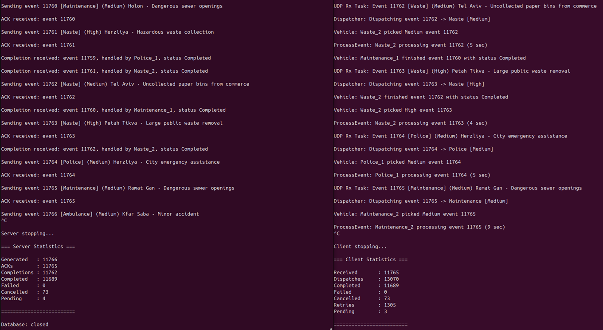
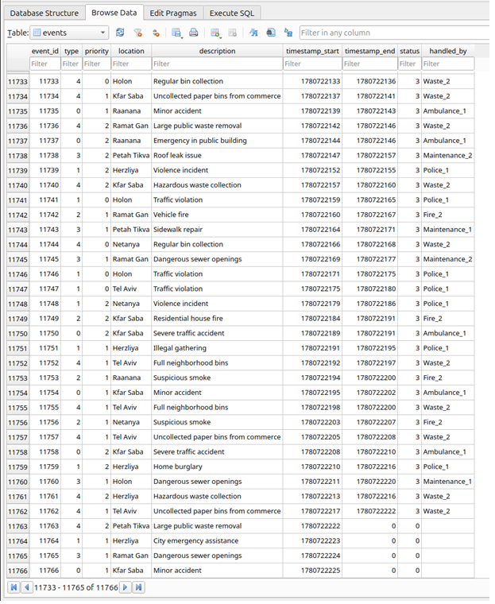

# City Emergency Dispatch

## [Real Time College](https://rt-ed.co.il/) - a multi-disciplinary Real-Time O.S. and Embedded Software Solutions Center, providing consulting, development, integration, training and support solutions.<br/>

## Real-Time Embedded Concepts Course Project

Course project developed as part of the Real-Time Embedded Concepts course.
The project simulates a city-wide emergency dispatch system where a central server generates emergency events and distributes them to specialized response departments. 
Each emergency vehicle operates as an independent FreeRTOS task and processes events according to their priority level.
The system demonstrates practical implementation of real-time operating system concepts including task scheduling, inter-task communication, synchronization mechanisms, 
fault recovery, resource management and UDP-based client-server communication.

## Assignment

Original course assignment provided by Real Time College:

- [City Emergency Dispatch Simulation — Server-Client UDP Version](Docs/City%20Emergency%20Dispatch%20Simulation%20%E2%80%94%20Server-Client%20UDP%20Version.docx)


## Development Environment

Operating System
- Ubuntu 24.04.4 LTS (Noble Numbat)

Development Tools
- Visual Studio Code 1.123.0
- GCC 13.3.0
- GNU Make 4.3

Libraries and Frameworks
- FreeRTOS POSIX
- SQLite3 3.45.1
- BSD/POSIX Socket API (UDP)

## Overview

The project simulates a city-wide emergency dispatch system built on top of FreeRTOS POSIX.
A central server continuously generates emergency events, stores them in an SQLite database and distributes them to specialized departments using UDP communication. 
On the client side, events are dispatched to priority-based queues and processed by independent vehicle tasks representing emergency response units.
The system includes Shift Manager and Fault Manager components responsible for resource management, event retry handling and dynamic vehicle availability control.

The application demonstrates the use of:

- FreeRTOS Tasks
- Queues
- Mutexes
- Event Groups
- Priority-Based Scheduling
- UDP Client-Server Communication
- SQLite Persistence
- Fault Recovery and Retry Mechanisms
- Dynamic Resource Management

## System Components

### Server

- Generates random city events
- Stores generated events in SQLite
- Sends events to the client via UDP
- Receives acknowledgements and completion reports
- Maintains event processing statistics

### Client

- Receives events from the server
- Dispatches events according to department and priority
- Processes events using dedicated vehicle tasks
- Manages vehicle availability through Shift Manager
- Retries interrupted events through Fault Manager
- Reports completion results to the server

## Departments

- Ambulance
- Police
- Fire Department
- Maintenance
- Waste Collection
- Electric Services

## Task Architecture

### Server Tasks

| Task | Description |
|--------|--------|
| ServerEventGeneratorTask | Generates random city emergency events |
| ServerUdpTxTask | Sends generated events to the client |
| ServerUdpRxTask | Receives acknowledgements and completion reports |

### Client Tasks

| Task | Description |
|--------|--------|
| ClientUdpRxTask | Receives UDP messages from the server |
| ClientDispatcherTask | Routes events to department priority queues |
| VehicleTask | Represents an emergency vehicle and processes assigned events |
| ShiftManagerTask | Monitors department workload and vehicle availability |
| FaultManagerTask | Retries interrupted events and manages event recovery |

## Event Lifecycle

```text
ServerEventGeneratorTask
        ↓
Generate Event
        ↓
Store Event in SQLite
        ↓
ServerUdpTxTask
        ↓
UDP
        ↓
ClientUdpRxTask
        ↓
ClientDispatcherTask
        ↓
Department Priority Queue
        ↓
VehicleTask
        ↓
Completion Report
        ↓
ServerUdpRxTask
        ↓
Update Event Status in SQLite
```

## Key Features

- Priority-based event scheduling
- Independent vehicle task execution
- Department-specific event routing
- Automatic retry mechanism
- Event cancellation support
- Dynamic vehicle availability management
- Fault recovery through Fault Manager
- Runtime statistics collection
- SQLite event persistence

## Build

```bash
make clean
make
```

## Run Order

1. Start the client.
2. Start the server.

### Client

```bash
./build/city_emergency_dispatch -client
```

### Server

```bash
./build/city_emergency_dispatch -server
```

## Stopping the Application

To stop the simulation gracefully, press `Ctrl+C` in both terminal windows.

Recommended shutdown order:

1. Stop the server
2. Stop the client

Both applications handle termination signals and print final runtime statistics before exiting. The server also closes the SQLite database and UDP socket during shutdown.

## Stress Test Results

The system was stress-tested for more than 10 hours of continuous operation.

### Runtime Statistics



Final statistics:

- Generated Events: 11,766
- Acknowledgements Received: 11,765
- Completion Reports Received: 11,762
- Successfully Completed Events: 11,689
- Cancelled Events: 73
- Retries Performed: 1,305
- Pending Events at Shutdown: 4

### SQLite Database Verification



The SQLite database contains all generated events and their processing status. The final pending records match the runtime statistics reported by the server and client.


## Author

Ilia Rakhlevski
